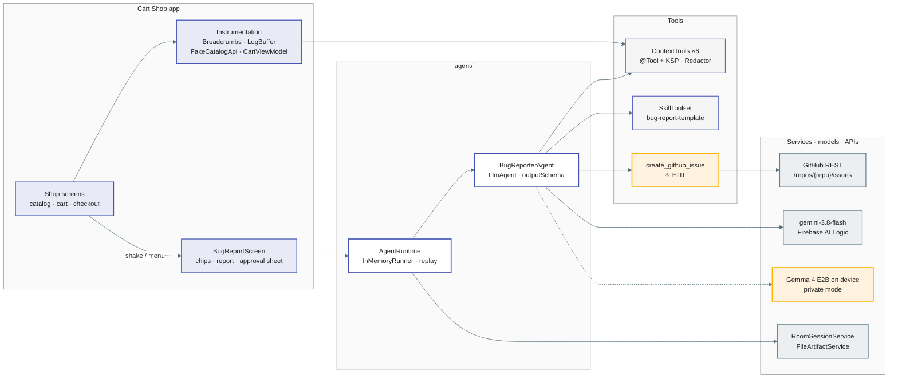
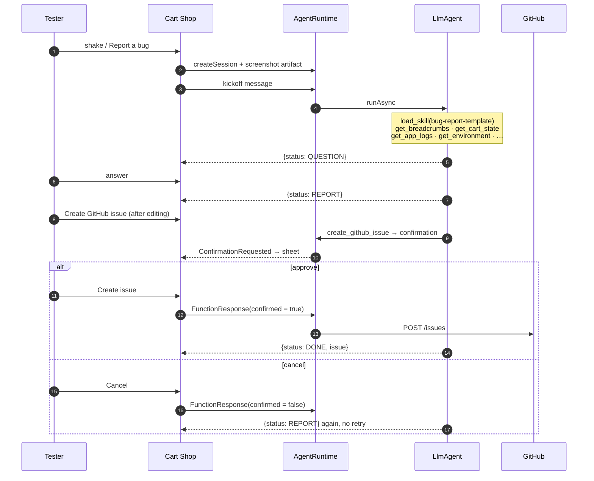

# Bug Reporter (Cart Shop) — ADK for Kotlin demo

A small Android shop with a deliberately broken cart, and an **agentic bug reporter** built with
[ADK for Kotlin](https://github.com/google/adk-kotlin) 1.0.1. Shake the phone (or pick *Report a bug*)
and an `LlmAgent` collects the evidence a developer would ask for, asks the tester at most two
questions, drafts a structured report and, **only after you approve it**, files a GitHub issue.

## What you'll learn

| ADK feature | Where |
|---|---|
| `LlmAgent` with a plain-Kotlin instruction and a Firebase AI Logic (`gemini-3.8-flash`) model | `agent/BugReporterAgent.kt`, `agent/AgentRuntime.kt` |
| `@Tool` / `@Param` functions turned into tools by the KSP processor (`generatedTools()`) | `agent/ContextTools.kt`, `agent/GitHubTools.kt` |
| Human-in-the-loop with `requireConfirmation = true` and the `adk_request_confirmation` round trip | `agent/GitHubTools.kt`, `AgentRuntime.sendConfirmation`, `ui/components/ConfirmationSheet.kt` |
| Skills (`SkillToolset` + `AssetSkillSource`) with progressive disclosure of `assets/*.md` | `assets/skills/bug-report-template/` |
| Structured output (`outputSchema` + `outputKey`) with a hand-built `Schema` | `agent/BugReportSchema.kt` |
| Persistent sessions with `RoomSessionService`: kill the app mid-report and it resumes | `AgentRuntime.replay`, `ui/bugreport/BugReportViewModel.kt` |
| Artifacts with `FileArtifactService` (the screenshot travels as an artifact, not as prompt text) | `AgentRuntime.saveScreenshot` |
| Streaming (`RunConfig(streamingMode = SSE)`) and event → UI mapping (tool chips) | `AgentRuntime.run`, `ui/components/ToolCallChips.kt` |
| On-device model swap: the same agent code runs on `LiteRtLmModel` (Gemma 4 E2B) in *private mode* | `agent/ModelStore.kt`, `ui/settings/` |

Privacy is enforced in code, not by prompt: every tool passes its output through `Redactor`
before the model sees it (`RedactorTest` proves the fake user's name and email never leak).

## Architecture



### One report, end to end



## The bug (`DISCOUNT-STALE`)

`CartViewModel` freezes the coupon discount as an absolute amount when the coupon is applied and
never recomputes it when quantities change. No exception, no log line.

Repro: Headphones ($400) → quantity 3 → coupon `HALF` → quantity 1 → total shows **−$200.00**.
`CartViewModelTest` pins this behaviour so the demo cannot silently heal.

## Private mode is also a lesson about small models

With the full six-tool loop a 2B model on a phone spends minutes per turn and sometimes invents tool
names (ADK then throws `BaseTool ... not found`). So in private mode the app pre-collects and
redacts the same context into the first message (`AgentRuntime.kickoffMessageWithContext`) and
gives the agent only the skill toolset plus `create_github_issue`. Skills, structured output and the
approval sheet stay identical; `BugReporterAgent.create(onDevice = true)` is the whole difference. If
the small model answers in prose instead of the JSON schema, `BugReportSchema.parseTurn` degrades it
to a question.

## Setup

1. **Firebase**: register `dev.ykro.bugreporter` in your Firebase project, enable *Firebase AI Logic*
   (Gemini Developer API) and drop `google-services.json` into `app/`. Without it the app still
   builds; the cloud agent then reports "Firebase is not configured".
   **App Check**: Firebase AI Logic rejects unattested requests once enforcement is on. Register the
   signing certificate's SHA-256 (`./gradlew signingReport`) for Play Integrity; debug builds install
   the *debug provider* instead (`src/debug/.../AppCheckSetup.kt`), so on first launch copy the token
   logcat prints (`Enter this debug secret into the allow list`) into App Check → *Manage debug tokens*.
2. **GitHub**: copy `local.properties.example` to `local.properties` and set `GITHUB_TOKEN`
   (fine-grained PAT with *Issues: read & write* on one repo) and `GITHUB_REPO=owner/repo`. Both are
   read at build time into `BuildConfig`. Without them the agent still drafts the report and the
   confirmation sheet still appears; the tool returns an error.
3. **Private mode (optional)**: Settings → download `gemma-4-E2B-it.litertlm` (2.6 GB) or push it:
   `adb push gemma-4-E2B-it.litertlm /sdcard/Android/data/dev.ykro.bugreporter/files/`.
4. Build and run: `./gradlew :app:installDebug` (JDK 17+, Gradle 9.7.1 / AGP 9.4.0 pinned by the wrapper).

## Demo script

1. Catalog → Headphones → add to cart. Set quantity to 3, apply `HALF`, set quantity back to 1.
2. Shake the device (emulator: *Extended controls → Virtual sensors → Move*) or *⋮ → Report a bug*.
3. Watch the chips: `load_skill` (amber) then `get_breadcrumbs`, `get_cart_state`, `get_app_logs`,
   `get_last_network_exchange`, `get_environment`, `get_screenshot_artifact_name`.
4. Answer the one or two questions. The report card appears (editable), with a highlighted hypothesis.
5. *Create GitHub issue* → the agent calls `create_github_issue` → ADK pauses → the approval sheet
   shows the exact Markdown body → *Create issue*. The issue number and link appear.
6. Kill the process mid-conversation (`adb shell am force-stop dev.ykro.bugreporter`), reopen: the
   conversation, chips and pending approval come back from Room.

## Verified on the emulator (Pixel_9_API_36)

Cart bug repro, screenshot artifact + Room session creation, chips, kill-and-resume, private mode
through the first question (`load_skill`, `list_skills`, question in ~4 min). The cloud path and the
GitHub call need your `google-services.json` and `local.properties`.

## Layout

```
app/src/main/kotlin/dev/ykro/bugreporter/
  agent/            agent, tools, schema, GitHub client, model store, ADK runtime
  cart/             CartViewModel (home of the bug)
  data/             Room cart, catalog, fake API, DataStore settings
  instrumentation/  breadcrumbs, log buffer, shake detector, screenshot capture
  ui/               Compose screens (catalog, product, cart, checkout, bug report, settings)
app/src/main/assets/skills/bug-report-template/   SKILL.md + issue template, checklist, severity guide
app/src/test/                                     Redactor, Breadcrumbs, BugReportSchema, CartViewModel bug repro
```
